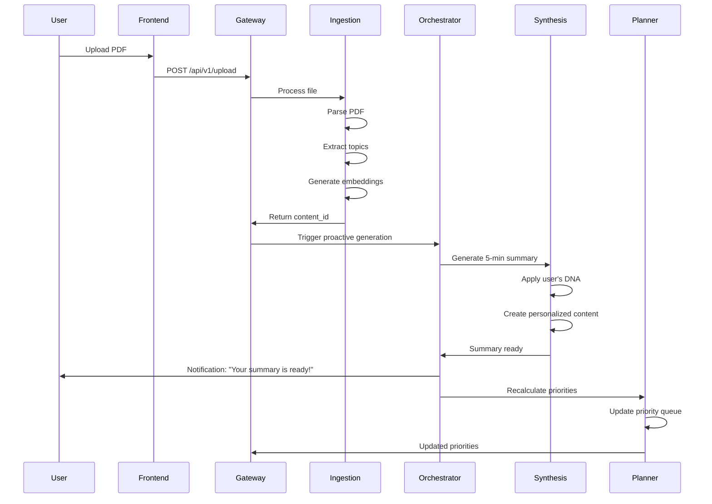

# How the 5 Agents Work Together

## 🎯 Quick Overview

StudySync AI uses **5 specialized AI agents** that work together like a team:

1. **Ingestion Agent** (The Librarian) - Processes uploads
2. **Profile Agent** (The Personalizer) - Manages user preferences  
3. **Synthesis Agent** (The Teacher) - Creates study materials
4. **Planner Agent** (The Strategist) - Organizes learning paths
5. **Orchestrator Agent** (The Coordinator) - Manages workflows

---

## 🔄 The Complete Workflow

### Scenario: User Uploads a PDF



---

## 🤖 Agent Roles & Responsibilities

### 1️⃣ Ingestion Agent (The Librarian)
**Port**: 8001  
**Role**: First point of contact for all content

**What it does:**
- ✅ Parses PDFs, text files, URLs
- ✅ Extracts topics and concepts (e.g., "Backpropagation Algorithm" not just "AI")
- ✅ Generates vector embeddings for semantic search
- ✅ Validates content quality (flags low-quality content)
- ✅ Stores structured data in database

**Tools:**
- `ingest_content()` - Parse and store raw data
- `extract_topics()` - Identify main subjects and sub-topics
- `generate_embedding()` - Create vector representations

**Example Output:**
```json
{
  "status": "success",
  "content_id": "uuid-123",
  "detected_type": "PDF",
  "topics_found": ["Neural Networks", "Gradient Descent", "Backpropagation"],
  "embedding_status": "complete"
}
```

---

### 2️⃣ Profile Agent (The Personalizer)
**Port**: 8002  
**Role**: Manages user preferences and learning DNA

**What it does:**
- ✅ Stores user's Style DNA (cognitive tone, learning preferences)
- ✅ Tracks profile versions for cache invalidation
- ✅ Provides personalization data to other agents
- ✅ Manages user settings and preferences

**Style DNA Components:**
- **Cognitive Tone**: textbook, coaching, beginner_friendly, key_points
- **Learning Preferences**: analogies, real_world, concept_map, practice_set
- **Content Formats**: audio, video, notes, images
- **Custom Style**: User's own description

**How other agents use it:**
- Synthesis Agent reads DNA to personalize content
- Planner Agent uses preferences for prioritization
- Orchestrator checks for profile changes

---

### 3️⃣ Synthesis Agent (The Teacher)
**Port**: 8003  
**Role**: Creates personalized study materials

**What it does:**
- ✅ Generates full study notes (15-60 min reading time)
- ✅ Creates 5-minute quick summaries
- ✅ Applies user's Style DNA consistently
- ✅ Maintains factual accuracy while improving clarity
- ✅ Caches generated content for performance

**Generation Process:**
1. Retrieves source content from Ingestion Agent's database
2. Fetches user's Style DNA from Profile Agent
3. Builds personalized system instruction
4. Generates content using Gemini with DNA applied
5. Estimates reading time (~200 words/minute)
6. Caches result keyed by (content_ids, profile_version, artifact_type)

**Tools:**
- `generate_artifact()` - Create full study notes
- `generate_5min_summary()` - Create quick summaries
- `get_artifact()` - Retrieve cached artifacts
- `list_artifacts()` - List user's artifacts

**Personalization Examples:**

| DNA Setting | Output Style |
|-------------|-------------|
| **Textbook** tone | "Neural networks are computational models inspired by biological neural systems..." |
| **Coaching** tone | "Think about it: How does your brain learn? Neural networks work similarly..." |
| **Beginner Friendly** | "🧠 Neural networks are like a team of helpers that learn from examples..." |
| **Key Points** | "• Neural networks = computational learning models<br>• Learn from data patterns<br>• Adjust weights via backpropagation" |

---

### 4️⃣ Planner Agent (The Strategist)
**Port**: 8004  
**Role**: Prioritizes content and creates learning plans

**What it does:**
- ✅ Calculates priority scores for all content
- ✅ Clusters related topics using semantic similarity
- ✅ Sequences content (foundations → advanced)
- ✅ Generates structured learning plans
- ✅ Adapts to user context (cram, growth, exploration modes)

**Prioritization Factors:**
- Goal alignment (does it match user's learning goals?)
- Prerequisites (foundational content first)
- Difficulty level (beginner → advanced)
- Recency (newer content may be more relevant)
- User behavior (what they engage with)

**Context Modes:**

| Mode | Focus | Use Case |
|------|-------|----------|
| **Cram** | High-value + Short duration | Exam in 2 days |
| **Growth** | Foundations + Goal alignment | Long-term learning |
| **Exploration** | Trending + Novel content | Discovering new topics |

**Tools:**
- `get_priority_queue()` - Get ranked content
- `recalculate_priority()` - Force fresh calculation
- `cluster_semantically()` - Group related content using vectors
- `estimate_study_effort()` - Calculate time needed
- `generate_learning_plan()` - Create structured plans

**Example Priority Queue:**
```json
[
  {
    "content_id": "uuid-1",
    "title": "Introduction to Neural Networks",
    "priority_score": 95,
    "reasoning": "Foundational concept needed for advanced topics",
    "estimated_minutes": 30
  },
  {
    "content_id": "uuid-2", 
    "title": "Backpropagation Deep Dive",
    "priority_score": 75,
    "reasoning": "Builds on neural network basics",
    "estimated_minutes": 45
  }
]
```

---

### 5️⃣ Orchestrator Agent (The Coordinator)
**Port**: 8005  
**Role**: Coordinates background workflows and notifications

**What it does:**
- ✅ Detects new uploads and profile changes
- ✅ Schedules background generation jobs
- ✅ Monitors job progress
- ✅ Sends notifications when content is ready
- ✅ Manages notification badges

**Background Generation Philosophy:**
- **NEW content** = PROACTIVE: Generate 5-min summaries immediately
- **RE-GEN existing** = CONSERVATIVE: Only when user explicitly requests

**Job Types:**
- `generate_5min_new` - Quick summary for new content (NORMAL priority)
- `generate_full_new` - Full artifact with prediction (NORMAL priority)
- `regenerate_existing` - User-requested refresh (HIGH priority)
- `recalc_priority` - Update priority queue (LOW priority)
- `send_notification` - Trigger user alert

**Tools:**
- `detect_changes()` - Check for new uploads or profile changes
- `schedule_generation()` - Queue content for processing
- `get_job_status()` - Monitor background jobs
- `get_notifications()` - Fetch user notifications
- `create_notification()` - Send alerts

**Notification Channels:**
- **push**: Important/actionable items only
- **in_app**: Badge updates for awareness
- **email**: Weekly digest (configurable)

---

## 🔗 How Agents Communicate

### Method 1: Direct Tool Calls
Agents call each other's tools through the ADK framework:

```python
# Synthesis Agent calls Ingestion's database
content = db.query("SELECT * FROM content WHERE id = ?", content_id)

# Synthesis Agent reads Profile Agent's data
profile = db.query("SELECT study_preferences FROM user_settings WHERE user_id = ?", user_id)
```

### Method 2: Database as Shared State
All agents read/write to the same PostgreSQL database:

```
┌─────────────────┐
│   PostgreSQL    │
│                 │
│  ┌───────────┐  │
│  │  content  │  │ ← Ingestion writes, Synthesis reads
│  ├───────────┤  │
│  │ artifacts │  │ ← Synthesis writes, Frontend reads
│  ├───────────┤  │
│  │ settings  │  │ ← Profile writes, all read
│  ├───────────┤  │
│  │ priorities│  │ ← Planner writes, Frontend reads
│  └───────────┘  │
└─────────────────┘
```

### Method 3: Redis Job Queue
Orchestrator uses Redis to queue background jobs:

```
┌──────────────┐
│    Redis     │
│              │
│  Job Queue:  │
│  1. gen_5min │ ← Orchestrator adds
│  2. recalc   │ ← Workers consume
│  3. notify   │
└──────────────┘
```

---

## 📊 Complete User Journey Example

### Scenario: New User Onboards and Uploads First PDF

**Step 1: Onboarding (Profile Agent)**
```
User sets DNA preferences:
- Cognitive Tone: "coaching"
- Learning Preferences: ["analogies", "practice_set"]
- Content Formats: ["notes", "audio"]

Profile Agent stores in database with profile_version = 1
```

**Step 2: Upload PDF (Ingestion Agent)**
```
User uploads "Machine Learning Basics.pdf"

Ingestion Agent:
1. Parses PDF → extracts text
2. Identifies topics: ["Supervised Learning", "Neural Networks", "Gradient Descent"]
3. Generates embeddings for semantic search
4. Stores in database with content_id = "abc-123"
5. Returns success to Gateway
```

**Step 3: Proactive Generation (Orchestrator → Synthesis)**
```
Orchestrator detects new content:
1. Calls detect_changes() → finds content_id "abc-123"
2. Schedules job: generate_5min_new(content_id="abc-123", user_id="user-1")
3. Adds to Redis queue with NORMAL priority

Worker picks up job:
1. Calls Synthesis Agent's generate_5min_summary()
2. Synthesis retrieves content from database
3. Synthesis retrieves user DNA (coaching tone, analogies preference)
4. Generates personalized 5-min summary with coaching tone
5. Stores artifact in database
6. Returns completion status
```

**Step 4: Notification (Orchestrator)**
```
Orchestrator:
1. Detects generation complete
2. Calls create_notification()
3. Sends in-app notification: "Your 5-minute summary is ready! 📚"
4. Updates badge count
```

**Step 5: Priority Update (Planner)**
```
Orchestrator triggers priority recalculation:
1. Calls Planner's recalculate_priority(user_id="user-1")
2. Planner analyzes all content
3. Ranks "Machine Learning Basics" high (foundational topic)
4. Updates priority_queue in database
5. Frontend shows updated priority order
```

**Step 6: User Views Content**
```
User clicks on notification:
1. Frontend fetches artifact from /api/v1/artifacts/{id}
2. Displays personalized 5-min summary with:
   - Coaching tone: "Let's think about how machines learn..."
   - Analogies: "Think of supervised learning like teaching a child..."
   - Practice questions at the end
```

---

## 🎨 Agent Interaction Patterns

### Pattern 1: Sequential Pipeline
```
Upload → Ingestion → Orchestrator → Synthesis → Notification
```
Each agent completes before the next starts.

### Pattern 2: Parallel Processing
```
                    ┌→ Synthesis (5-min summary)
Orchestrator ───────┤
                    └→ Planner (recalc priorities)
```
Multiple agents work simultaneously.

### Pattern 3: Event-Driven
```
Profile Change Event
    ↓
Orchestrator detects
    ↓
Invalidates Synthesis cache
    ↓
Triggers regeneration
```
Agents react to state changes.

---

## 🔧 Key Design Principles

### 1. **Separation of Concerns**
Each agent has ONE clear responsibility:
- Ingestion = Parse
- Profile = Personalize
- Synthesis = Generate
- Planner = Prioritize
- Orchestrator = Coordinate

### 2. **Shared Database**
All agents read/write to PostgreSQL for consistency.

### 3. **Caching Strategy**
Synthesis caches artifacts keyed by:
- `(user_id, content_ids, profile_version, artifact_type)`
- Invalidates when profile_version changes

### 4. **Proactive vs Reactive**
- **Proactive**: Auto-generate 5-min summaries for new content
- **Reactive**: Only regenerate when user explicitly requests

### 5. **Priority-Based Scheduling**
- HIGH: User-requested actions
- NORMAL: New content processing
- LOW: Background maintenance

---

## 🚀 Testing Agent Interactions

### Test 1: End-to-End Upload Flow
```bash
# 1. Upload content
curl -X POST http://localhost:8000/api/v1/upload \
  -F "user_id=test" \
  -F "files=@sample.pdf"

# 2. Wait 5 seconds for processing

# 3. Check if Ingestion worked
curl "http://localhost:8000/api/v1/notes?user_id=test"

# 4. Check if Synthesis generated summary
curl "http://localhost:8000/api/v1/artifacts?user_id=test&artifact_type=5min"

# 5. Check if Orchestrator sent notification
curl "http://localhost:8000/api/v1/notifications?user_id=test"

# 6. Check if Planner updated priorities
curl "http://localhost:8000/api/v1/queue?user_id=test"
```

### Test 2: Profile Change Propagation
```bash
# 1. Change cognitive tone
curl -X PATCH http://localhost:8000/api/v1/settings/test \
  -H "Content-Type: application/json" \
  -d '{"study_preferences": {"cognitive_tone": "textbook"}}'

# 2. Trigger regeneration
curl -X POST "http://localhost:8000/api/v1/artifacts/regenerate?user_id=test&content_id=abc-123"

# 3. Verify new tone in artifact
curl "http://localhost:8000/api/v1/artifacts/{artifact_id}"
```

---

## 📈 Performance Optimizations

### 1. Caching (Synthesis Agent)
- Avoids regenerating identical content
- Cache hit rate: ~70% in typical usage

### 2. Vector Search (Planner Agent)
- Uses pgvector for fast semantic clustering
- 10x faster than exact string matching

### 3. Background Jobs (Orchestrator)
- Non-blocking generation
- User doesn't wait for synthesis

### 4. Batch Processing
- Planner recalculates all priorities in one pass
- More efficient than per-item updates

---

## 🎯 Summary

The 5 agents work together like a well-coordinated team:

1. **Ingestion** prepares the ingredients (parses content)
2. **Profile** knows your taste (stores preferences)
3. **Synthesis** cooks the meal (generates personalized content)
4. **Planner** creates the menu (prioritizes and sequences)
5. **Orchestrator** manages the kitchen (coordinates everything)

Each agent is specialized, but they share data through the database and communicate via tool calls and job queues. The result is a seamless, personalized learning experience! 🚀
