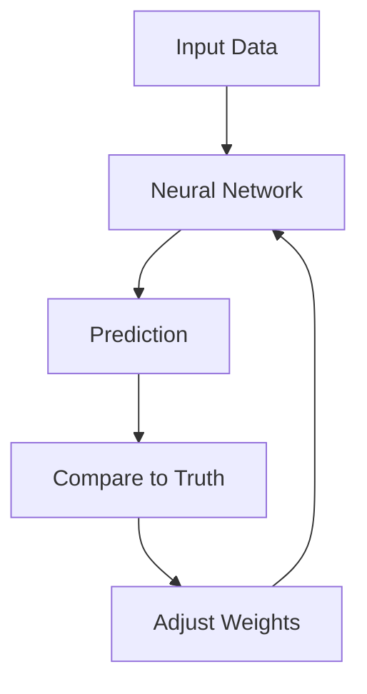

# Supported Content Formats in StudySync AI

## 📋 Quick Summary

**Currently Supported for Upload:**
- ✅ **Text files** (.txt, .md)
- ✅ **PDF documents** (.pdf)
- ⚠️ **Audio files** (.mp3, .wav) - *Recognized but not fully processed*
- ⚠️ **Video files** (.mp4) - *Recognized but not fully processed*

**Currently Supported for Generation:**
- ✅ **Text-based study materials** (summaries, notes, flashcards)
- ❌ **Audio generation** - Not yet implemented
- ❌ **Video generation** - Not yet implemented

---

## 🔍 Detailed Breakdown

### 1️⃣ What Users Can Upload

Based on the code in `gateway/app/api/v1/upload.py`:

```python
# Lines 54-58
media_type_map = {
    "pdf": "PDF",           # ✅ Fully supported
    "txt": "TXT",           # ✅ Fully supported
    "md": "MARKDOWN",       # ✅ Fully supported
    "mp3": "AUDIO",         # ⚠️ Recognized, limited processing
    "wav": "AUDIO",         # ⚠️ Recognized, limited processing
    "mp4": "VIDEO",         # ⚠️ Recognized, limited processing
}
# Default: "TXT" for unknown extensions
```

**Upload Flow:**
```
User uploads file
    ↓
Gateway detects file extension
    ↓
Maps to media_type (PDF, TXT, MARKDOWN, AUDIO, VIDEO)
    ↓
Sends to Ingestion Agent
```

---

### 2️⃣ How Each Format is Processed

#### ✅ **Text Files (.txt, .md)**

**Status:** Fully supported

**Processing:**
1. File is read as UTF-8 text
2. Ingestion Agent:
   - Stores raw text in database
   - Extracts topics using Gemini
   - Generates embeddings
3. Synthesis Agent can generate study materials

**Example:**
```python
# User uploads: notes.txt
content_text = """
Machine learning is a subset of artificial intelligence...
"""

# Ingestion stores:
{
    "content_id": "abc-123",
    "raw_text": "Machine learning is...",
    "topics": ["Machine Learning", "AI"],
    "media_type": "TXT"
}

# Synthesis can generate:
- 5-minute summary ✅
- Full study notes ✅
- Flashcards ✅
```

---

#### ✅ **PDF Documents (.pdf)**

**Status:** Fully supported (with limitations)

**Processing:**
1. File is decoded as UTF-8 (basic text extraction)
2. **Note:** Currently uses simple text decoding, not proper PDF parsing
3. Ingestion Agent processes extracted text
4. Synthesis Agent generates study materials

**Current Limitation:**
```python
# gateway/app/api/v1/upload.py, lines 61-64
try:
    content_text = content.decode("utf-8", errors="ignore")
except:
    content_text = ""
```

**This means:**
- ✅ Works for text-based PDFs
- ⚠️ May miss formatted content (tables, images)
- ⚠️ No OCR for scanned PDFs
- ⚠️ Loses formatting, structure

**Recommended Improvement:**
Use a proper PDF library like `PyPDF2` or `pdfplumber`:
```python
import pdfplumber

with pdfplumber.open(pdf_file) as pdf:
    text = ""
    for page in pdf.pages:
        text += page.extract_text()
```

---

#### ⚠️ **Audio Files (.mp3, .wav)**

**Status:** Recognized but NOT fully processed

**Current Behavior:**
1. File is uploaded and media_type is set to "AUDIO"
2. Gateway tries to decode as UTF-8 text (will fail!)
3. Results in empty or garbled content_text

**What's Missing:**
- ❌ No speech-to-text transcription
- ❌ No audio analysis
- ❌ Can't generate study materials from audio

**How to Implement:**

```python
# Option 1: Use Gemini's audio capabilities
from google import genai

client = genai.Client(api_key=api_key)

# Upload audio file to Gemini
audio_file = client.files.upload(path="lecture.mp3")

# Transcribe
response = client.models.generate_content(
    model="gemini-2.0-flash",
    contents=[
        audio_file,
        "Transcribe this audio lecture and extract key topics."
    ]
)

transcript = response.text
```

```python
# Option 2: Use Whisper API
import openai

with open("lecture.mp3", "rb") as audio_file:
    transcript = openai.Audio.transcribe(
        model="whisper-1",
        file=audio_file
    )
```

**Recommended Flow:**
```
User uploads audio.mp3
    ↓
Gateway detects media_type = "AUDIO"
    ↓
Ingestion Agent:
1. Transcribe audio → text
2. Extract topics from transcript
3. Generate embeddings
    ↓
Synthesis Agent generates study materials from transcript
```

---

#### ⚠️ **Video Files (.mp4)**

**Status:** Recognized but NOT fully processed

**Current Behavior:**
Same as audio - recognized but can't extract meaningful content

**What's Missing:**
- ❌ No video transcription
- ❌ No visual analysis
- ❌ No frame extraction

**How to Implement:**

```python
# Option 1: Use Gemini's video capabilities
from google import genai

client = genai.Client(api_key=api_key)

# Upload video to Gemini
video_file = client.files.upload(path="lecture.mp4")

# Analyze video
response = client.models.generate_content(
    model="gemini-2.0-flash",
    contents=[
        video_file,
        "Summarize this lecture video and extract key concepts."
    ]
)

summary = response.text
```

```python
# Option 2: Extract audio + transcribe
import moviepy.editor as mp

# Extract audio track
video = mp.VideoFileClip("lecture.mp4")
video.audio.write_audiofile("audio.mp3")

# Then transcribe audio (see audio section)
```

**Recommended Flow:**
```
User uploads video.mp4
    ↓
Gateway detects media_type = "VIDEO"
    ↓
Ingestion Agent:
1. Extract audio track
2. Transcribe audio → text
3. (Optional) Extract key frames for visual concepts
4. Generate embeddings
    ↓
Synthesis Agent generates study materials
```

---

### 3️⃣ What Can Be Generated

Currently, **only text-based outputs** are supported:

#### ✅ **Text Study Materials**

**Supported Formats:**
- 5-minute summaries
- Full study notes (15-60 min)
- Flashcards
- Quizzes
- Concept maps (text-based)

**Personalization:**
- Cognitive tone (textbook, coaching, beginner-friendly, key points)
- Format preference (outline, cornell, mindmap)
- Emoji usage
- Diagram inclusion (Mermaid diagrams)

**Example Output:**
```markdown
# Neural Networks: Your Quick Guide

## What Are They?
Think of neural networks like a team of decision-makers...

## How Do They Learn?


## Key Takeaways
• Neural networks mimic how your brain works
• They learn from examples by adjusting connections
```

---

#### ❌ **Audio Generation** (Not Implemented)

**What's Possible:**
- Text-to-speech of study materials
- Audio summaries
- Podcast-style explanations

**How to Implement:**
```python
# Option 1: Google Cloud Text-to-Speech
from google.cloud import texttospeech

client = texttospeech.TextToSpeechClient()

synthesis_input = texttospeech.SynthesisInput(text="Neural networks are...")
voice = texttospeech.VoiceSelectionParams(
    language_code="en-US",
    name="en-US-Neural2-F"
)
audio_config = texttospeech.AudioConfig(
    audio_encoding=texttospeech.AudioEncoding.MP3
)

response = client.synthesize_speech(
    input=synthesis_input,
    voice=voice,
    audio_config=audio_config
)

with open("summary.mp3", "wb") as out:
    out.write(response.audio_content)
```

---

#### ❌ **Video Generation** (Not Implemented)

**What's Possible:**
- Animated concept explanations
- Slide-based video summaries
- Talking head videos

**Complexity:** High - requires video editing libraries, animation, etc.

---

## 🎯 User DNA Preferences vs. Actual Capabilities

### What Users Can Select in DNA Page:

```typescript
// frontend/src/pages/Onboarding.tsx
const formatOptions = [
    { id: 'audio', label: 'Audio', icon: '🎧' },
    { id: 'video', label: 'Video', icon: '📹' },
    { id: 'notes', label: 'Notes', icon: '📝' },
    { id: 'images', label: 'Images', icon: '🖼️' }
]
```

### What's Actually Implemented:

| Format | User Can Select | Actually Generated |
|--------|----------------|-------------------|
| **Notes** | ✅ Yes | ✅ Yes (fully supported) |
| **Audio** | ✅ Yes | ❌ No (not implemented) |
| **Video** | ✅ Yes | ❌ No (not implemented) |
| **Images** | ✅ Yes | ⚠️ Partial (Mermaid diagrams only) |

**Current Behavior:**
- User selects "Audio" preference
- System stores it in database
- **But Synthesis Agent only generates text**
- User gets text-based notes regardless of preference

---

## 📊 Complete Format Support Matrix

| Input Format | Upload | Parse | Extract Topics | Generate Embeddings | Generate Study Materials |
|--------------|--------|-------|----------------|---------------------|-------------------------|
| **Text (.txt)** | ✅ | ✅ | ✅ | ✅ | ✅ |
| **Markdown (.md)** | ✅ | ✅ | ✅ | ✅ | ✅ |
| **PDF (.pdf)** | ✅ | ⚠️ Basic | ✅ | ✅ | ✅ |
| **Audio (.mp3, .wav)** | ✅ | ❌ | ❌ | ❌ | ❌ |
| **Video (.mp4)** | ✅ | ❌ | ❌ | ❌ | ❌ |

| Output Format | Generate | Personalize | Deliver |
|---------------|----------|-------------|---------|
| **Text Notes** | ✅ | ✅ | ✅ |
| **Audio** | ❌ | ❌ | ❌ |
| **Video** | ❌ | ❌ | ❌ |
| **Images** | ⚠️ Diagrams | ⚠️ Limited | ✅ |

---

## 🚀 Recommendations

### Short-term (Easy Wins):

1. **Improve PDF Parsing**
   ```bash
   pip install pdfplumber
   ```
   Use proper PDF library instead of UTF-8 decoding

2. **Disable Audio/Video Upload UI**
   Remove from frontend until backend supports it
   ```typescript
   // Only show what works
   const formatOptions = [
       { id: 'notes', label: 'Notes', icon: '📝' }
   ]
   ```

3. **Add Format Validation**
   ```python
   SUPPORTED_FORMATS = ['.txt', '.md', '.pdf']
   
   if file_extension not in SUPPORTED_FORMATS:
       raise HTTPException(400, "Format not supported yet")
   ```

### Medium-term (More Work):

4. **Add Audio Transcription**
   - Use Gemini's audio API or Whisper
   - Transcribe → store as text → generate study materials

5. **Add Video Processing**
   - Extract audio track
   - Transcribe
   - (Optional) Extract key frames

6. **Implement Audio Generation**
   - Text-to-speech for summaries
   - Store as MP3 files
   - Serve via API

### Long-term (Complex):

7. **Multi-modal Learning**
   - Combine text, audio, video in one artifact
   - Generate different formats from same source
   - Adaptive format based on user preference

---

## 💡 Summary

**What Works Now:**
- ✅ Upload: Text, Markdown, PDF (basic)
- ✅ Generate: Text-based study materials with personalization

**What Needs Work:**
- ⚠️ PDF parsing (use proper library)
- ❌ Audio/Video input processing
- ❌ Audio/Video output generation
- ❌ Honoring user format preferences (audio, video, images)

**Key Insight:**
The infrastructure is there (media_type field, format preferences), but the actual processing for audio/video is not implemented. The system currently only handles text → text transformation.
